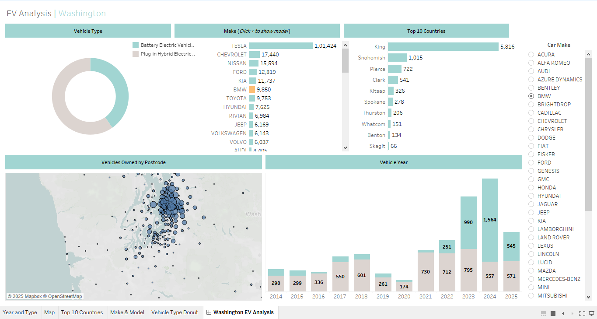

# 🚗 EV Analysis | Washington

## Introduction  
🔌 Curious about the electric vehicle (EV) landscape in Washington? This project visualizes the adoption of Battery Electric Vehicles (BEVs) and Plug-in Hybrid Electric Vehicles (PHEVs) across the state, diving deep into the makes, models, regional distribution, and yearly trends. Powered by Tableau, this dashboard offers a comprehensive snapshot of Washington’s EV growth.

📍 View the dashboard here: [WashingtonEV](/WashingtonEVanalysis.twbx/)

## Background  
As the push for greener transportation gains momentum, understanding the EV landscape helps stakeholders from policymakers to automakers make informed decisions. This project aims to answer key questions around EV ownership patterns, top-performing brands, and geographic hotspots within Washington state.

Data was sourced from Washington’s Department of Licensing EV dataset and visualized using Tableau to ensure an interactive, insightful experience.

## Objectives  
This dashboard seeks to explore:

- ⚡ What are the most popular EV types in Washington?
- 🚘 Which EV brands dominate the market?
- 🌍 Which counties and postcodes have the highest EV ownership?
- 📅 How has EV adoption evolved year by year?

## Tools I Used  
🧰 Here's the tech stack behind the dashboard:

- **Tableau Public**: For crafting visually engaging and interactive dashboards.  
- **Excel/CSV**: Data preparation and cleaning before visualization.  
- **Mapbox**: Embedded for geographic data visualization.  
- **Git & GitHub**: For version control and sharing the project repository.

## The Analysis  

### 🔄 Vehicle Type Distribution  
The donut chart shows the split between:
- **Battery Electric Vehicles (BEVs)**  
- **Plug-in Hybrid Electric Vehicles (PHEVs)**  
BEVs make up the majority of EVs in the state, indicating a strong shift toward fully electric mobility.

### 🏭 EV Make & Model  
- **Tesla** leads by a huge margin with over 100K vehicles.  
- Other notable players include **Chevrolet**, **Nissan**, and **Ford**.

### 🗺️ EV Ownership by County & Postcode  
- **King County** tops the list with over 5,800 vehicles.  
- Snohomish and Pierce follow, showing concentrated adoption in urban/suburban hubs.  
- The heatmap reveals EV hotspots around Seattle and surrounding areas.

### 📆 Vehicle Registration by Year  
- Registrations have seen exponential growth post-2018.  
- **2024** marks a peak with over 2,100 EVs registered so far, with **Battery EVs** significantly outpacing PHEVs.

## What I Learned  
This project helped sharpen my Tableau skills while gaining insights into real-world clean energy trends:

- 🔍 Mastered multi-tab dashboarding with filters and interactivity.
- 🗺️ Enhanced map visualizations using postcode granularity.
- 📊 Improved storytelling through visual design best practices.

## Conclusions  
### 📌 Key Insights:
- **Tesla dominates** the EV space in Washington, both in numbers and momentum.
- **Urban centers** like Seattle show the highest EV concentration.
- **BEVs are rapidly increasing**, especially in recent years, pointing to a sustainable future.

## 🚀 Closing Thoughts  
EVs are on a fast track in Washington, and this dashboard offers a real-time pulse of their growth. As charging infrastructure and awareness increase, we can expect even greater EV adoption. This project exemplifies how data visualization can illuminate important environmental and economic trends.
